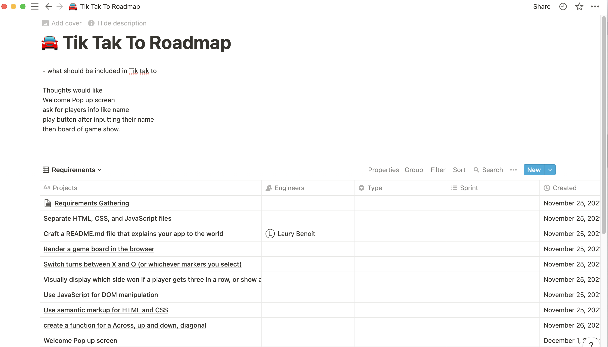
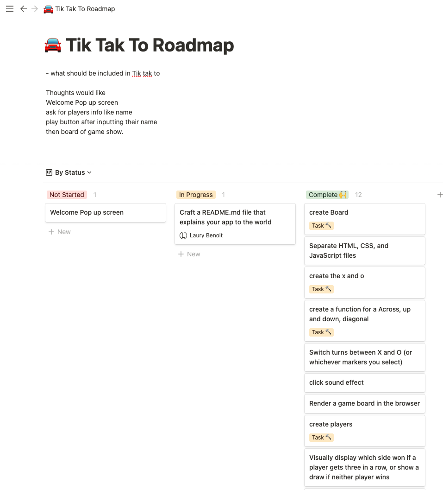
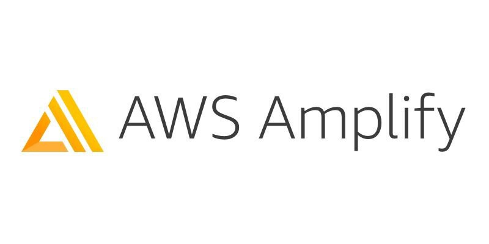
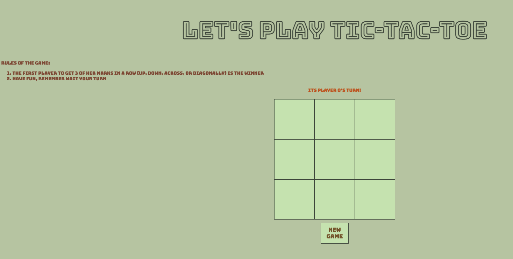

# Tic Tac Toe Game 

Thanks for visiting [My Tic Tac Toe Game ](https://main.d1gjmj53w24nj7.amplifyapp.com/)!

## Technology Used
- HTML
- CSS
- Javascript
- Notion

## Requirements 
*Render a game board in the browser
*Switch turns between X and O (or whichever markers you select)
*Visually display which side won if a player gets three in a row, or show a draw if neither player wins
*Include separate HTML / CSS / JavaScript files
*Stick with KISS (Keep It Simple Stupid) and DRY (Don't Repeat Yourself) principles
*Use JavaScript for DOM manipulation
*Deploy your game online, where the rest of the world can access it
*Use semantic markup for HTML and CSS (adhere to best practices)
*Have well-formatted, and well-commented code

## Kanban Method
To cover all the requirements Kanban method is used as shown below. 

Then Breaking the requirements to smaller 

## Issues 
Main issues I encounter:
- Understanding the logic of the game 
- Initializing the game board
- Writing a condition for winner
- Stoping the game if there is a winner

## AWS Amplify 
This application is deploy using AWS Amplify 

## Finish Product 

