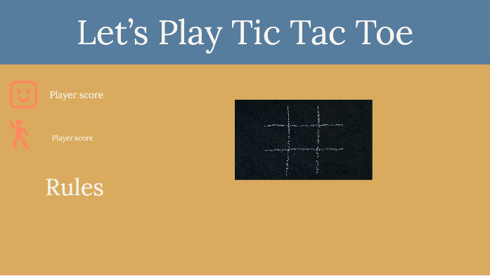

# Tic Tac Toe Game 

Thanks for visiting [My Tic Tac Toe Game ](https://main.d1gjmj53w24nj7.amplifyapp.com/)!

## Technology Used
- HTML
- CSS
- Javascript
- Bootstrap
- AWS Amplify
- Notion

## Requirements 
- Render a game board in the browser
- Switch turns between X and O (or whichever markers you select)
- Visually display which side won if a player gets three in a row, or show a draw if neither player wins
- Include separate HTML / CSS / JavaScript files
- Stick with KISS (Keep It Simple Stupid) and DRY (Don't Repeat Yourself) principles
- Use JavaScript for DOM manipulation
- Deploy your game online, where the rest of the world can access it
- Use semantic markup for HTML and CSS (adhere to best practices)
- Have well-formatted, and well-commented code

## User Stories
- As a user, I should be able to start a new tic tac toe game
- As a user, I should be able to click on a square to add X first and then O, and so on
- As a user, I should be shown a message after each turn for if I win, lose, tie or who's turn it is next
- As a user, I should not be able to click the same square twice
- As a user, I should be shown a message when I win, lose or tie
- As a user, I should not be able to continue playing once I win, lose, or tie
- As a user, I should be able to play the game again without refreshing the page

## Original Plan

## Kanban Method
To cover all the requirements Kanban method is used as shown below. 

Then Breaking the requirements to smaller 

## Issues 
Main issues I encounter:
- Understanding the logic of the game 
- Initializing the game board
- Writing a condition for winner
- Stoping the game if there is a winner

## What I have Learned 
- DOM element to manipulated different part of my project

## Changes/Later Implementation
- Spend so long creating the Board, and the look of it
- I would love to create a backend that would capture the player data such as name and their previous score  

## AWS Amplify 
This application is deploy using AWS Amplify 

## Finish Product 

